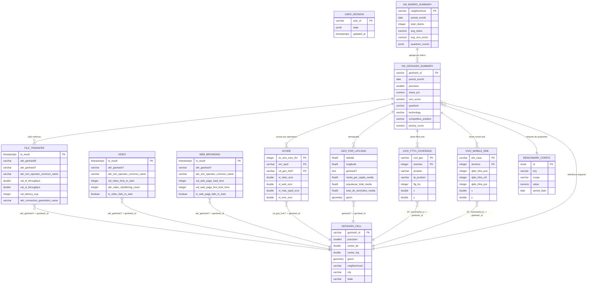

# Modelo Conceitual — Zoox x Vivo GeoIntelligence

**Versão**: 2.0 | **Data**: 2026-03-29
**Fonte**: docs/levantamento/Zoox_+_Vivo_Estrategia_v1203.pdf + CSVs operacionais

## Diagrama ER

## Narrativa de Relacionamentos

| Origem | Destino | Cardinalidade | Descrição | UC |
|--------|---------|---------------|-----------|-----|
| FILE_TRANSFER | GEOHASH_CELL | N:1 | Testes SpeedTest por geohash | UC001, UC005 |
| VIDEO | GEOHASH_CELL | N:1 | Testes de video por geohash | UC001 |
| WEB_BROWSING | GEOHASH_CELL | N:1 | Testes de web por geohash | UC001 |
| SCORE | GEOHASH_CELL | N:1 | Score mensal por geohash7 x operadora | UC004, UC009 |
| VIVO_FTTH_COVERAGE | GEOHASH_CELL | N:1 | Instalações FTTH Vivo por geohash (via coordenadas) | UC001, UC004 |
| VIVO_MOBILE_ERB | GEOHASH_CELL | N:1 | ERBs movel Vivo com linhas ativas por geohash | UC001, UC004 |
| GEO_POR_LATLONG | GEOHASH_CELL | N:1 | Dados socioeconomicos por geohash | UC004, UC010 |
| VW_GEOHASH_SUMMARY | BENCHMARK_CONFIG | N:1 | Limiares definem quadrante | RN001-01 |
| VW_GEOHASH_SUMMARY | VIVO_FTTH_COVERAGE | 1:N | Share FIBRA = instalações / domicilios | RN001-01 |
| VW_GEOHASH_SUMMARY | VIVO_MOBILE_ERB | 1:N | Share MOVEL = linhas / população | RN001-01 |
| VW_BAIRRO_SUMMARY | VW_GEOHASH_SUMMARY | 1:N | Bairro agrega N geohashes | UC010 |
| USER_SESSION | — | standalone | Estado da sessão por usuário | UC011, UC012 |

## Rastreabilidade: Entidade → ALI/AIE

| Entidade | Tipo | ALI/AIE ID | UC Principal |
|----------|------|------------|--------------|
| FILE_TRANSFER | AIE | D01 | UC001, UC004, UC005 |
| VIDEO | AIE | D02 | UC001, UC004 |
| WEB_BROWSING | AIE | D03 | UC001, UC004 |
| SCORE | AIE | D04 | UC004, UC009 |
| GEO_POR_LATLONG | AIE | D05 | UC004, UC010 |
| **VIVO_FTTH_COVERAGE** | AIE | **D11** | UC001, UC004 (share fibra) |
| **VIVO_MOBILE_ERB** | AIE | **D12** | UC001, UC004 (share movel) |
| USER_SESSION | ALI | D06 | UC011, UC012 |
| VW_GEOHASH_SUMMARY | ALI | D07 | UC001-UC010 |
| VW_BAIRRO_SUMMARY | ALI | D08 | UC010 |
| BENCHMARK_CONFIG | ALI | D10 | UC001, UC004, UC007 |
| GEOHASH_CELL | ALI | — | UC001, UC005, UC008 |
