# Modelo Conceitual — Zoox x Vivo GeoIntelligence

**Versão**: 4.0 | **Data**: 2026-04-09
**Fonte**: docs/levantamento/Zoox_+_Vivo_Estrategia_v1203.pdf + CSVs operacionais

## Diagrama ER

```mermaid
erDiagram
    %% ===== CAMADA RAW (AIE — dados externos Ookla/SpeedTest) =====
    FILE_TRANSFER {
        timestamptz ts_result PK
        varchar attr_geohash6
        varchar attr_geohash7
        varchar attr_sim_operator_common_name
        double val_dl_throughput
        double val_ul_throughput
        integer val_latency_avg
        varchar attr_connection_generation_name
    }

    VIDEO {
        timestamptz ts_result PK
        varchar attr_geohash7
        varchar attr_sim_operator_common_name
        integer val_video_time_to_start
        integer attr_video_rebuffering_count
        boolean is_video_fails_to_start
    }

    WEB_BROWSING {
        timestamptz ts_result PK
        varchar attr_geohash7
        varchar attr_sim_operator_common_name
        integer val_web_page_load_time
        integer val_web_page_first_byte_time
        boolean is_web_page_fails_to_load
    }

    SCORE {
        integer nu_ano_mes_rfrn PK
        varchar nm_oprd PK
        varchar cd_geo_hsh7 PK
        double vl_vdeo_scre
        double vl_web_scre
        double vl_nota_sped_scre
        double vl_cntv_scre
    }

    %% ===== CAMADA RAW (AIE — dados operacionais Vivo) =====
    VIVO_FTTH_COVERAGE {
        varchar cod_geo PK
        integer anomes PK
        varchar produto
        varchar tp_produto
        integer flg_loc
        double x
        double y
    }

    VIVO_MOBILE_ERB {
        varchar erb_casa PK
        integer anomes PK
        integer qtde_lnha_pos
        integer qtde_lnha_ctrl
        integer qtde_lnha_pre
        double x
        double y
    }

    GEO_POR_LATLONG {
        float8 latitude
        float8 longitude
        text geohash7
        float8 renda_per_capita_media
        float8 populacao_total_media
        float8 total_de_domicilios_media
        geometry geom
    }

    %% ===== CAMADA RAW (AIE — Speedtest Ookla rede fixa/móvel) =====
    NETWORK_PERFORMANCE_FIXED {
        bigint idResult PK
        timestamptz tsResult PK
        text attrProviderName
        double valDownloadMbps
        double valUploadMbps
        double valLatencyIqmMs
        double attrLocationLatitude
        double attrLocationLongitude
    }

    NETWORK_PERFORMANCE_MOBILE {
        bigint idResult PK
        timestamptz tsResult PK
        text attrSimOperatorCommonName
        integer valDownloadKbps
        integer valUploadKbps
        double valLatencyIqmMs
        double attrLocationLatitude
        double attrLocationLongitude
        boolean isDevice5gCapable
    }

    %% ===== CAMADA ANALITICA (ALI — mantidas pelo sistema) =====
    GEOHASH_CELL {
        varchar geohash_id PK
        smallint precision
        double center_lat
        double center_lng
        geometry geom
        varchar neighborhood
        varchar city
        varchar state
    }

    BENCHMARK_CONFIG {
        serial id PK
        varchar key
        varchar scope
        numeric value
        date period_date
    }

    USER_SESSION {
        varchar user_id PK
        jsonb state
        timestamptz updated_at
    }

    %% ===== CAMADA CRM + CAMADA 2 (ALI — dados derivados) =====
    GEOHASH_CRM {
        varchar geohash_id PK
        varchar period PK
        numeric avg_arpu
        varchar dominant_plan_type
        varchar device_tier
        numeric avg_income
        numeric population_density
    }

    CAMADA2_FIBRA {
        varchar geohash_id PK
        varchar period PK
        fibra_class classification
        smallint score
        score_label score_label
        numeric taxa_ocupacao
        numeric portas_disponiveis
        numeric potencial_mercado
        numeric sinergia_movel
    }

    CAMADA2_MOVEL {
        varchar geohash_id PK
        varchar period PK
        movel_class classification
        smallint score
        score_label score_label
        tech_recommendation tech_recommendation
        numeric speedtest_score
        numeric concentracao_renda
        numeric vulnerabilidade_concorrencia
    }

    %% ===== CAMADA DIAGNOSTICO (ALI — calculado pelo sistema) =====
    DIAGNOSTICO_GROWTH {
        varchar geohash_id PK
        smallint precision PK
        integer anomes PK
        numeric score_ookla
        numeric taxa_chamados
        numeric share_penetracao
        numeric delta_vs_lider
        fibra_class fibra_class
        movel_class movel_class
        numeric arpu_relativo
        varchar canal_dominante
        numeric canal_pct
        sinal_type sinal_percepcao
        sinal_type sinal_concorrencia
        sinal_type sinal_infraestrutura
        sinal_type sinal_comportamento
        recomendacao_type recomendacao
        text recomendacao_razao
    }

    %% ===== VIEWS DE SCORE QoE (v4 — scores.pdf) =====
    VW_SCORE_MOBILE {
        varchar geohash_id PK
        operator_name operator PK
        integer anomes PK
        numeric score_latencia
        numeric score_video
        numeric score_web
        numeric score_throughput
        numeric score_sinal
        boolean throughput_disponivel
        numeric score_final
        integer total_testes
    }

    VW_SCORE_FIBRA {
        varchar geohash_id PK
        operator_name operator PK
        integer anomes PK
        numeric score_responsividade
        numeric score_video
        numeric score_web
        numeric score_throughput
        boolean throughput_disponivel
        numeric score_final
        integer total_testes
    }

    %% ===== VIEWS (Camada Analitica) =====
    VW_GEOHASH_SUMMARY {
        varchar geohash_id PK
        date period_month
        smallint precision
        numeric share_pct
        numeric vivo_score
        varchar quadrant
        varchar technology
        varchar competitive_position
        numeric priority_score
        numeric satisfacao_fibra
        numeric satisfacao_movel
        quadrant_type quadrante_fibra
        quadrant_type quadrante_movel
    }

    VW_BAIRRO_SUMMARY {
        varchar neighborhood PK
        date period_month
        integer total_clients
        numeric avg_share
        numeric avg_vivo_score
        jsonb quadrant_counts
    }

    %% ===== RELACIONAMENTOS =====

    %% Network Performance → Geohash (via PostGIS)
    NETWORK_PERFORMANCE_FIXED }o--|| GEOHASH_CELL : "ST_GeoHash(lat,lng) -> geohash_id"
    NETWORK_PERFORMANCE_MOBILE }o--|| GEOHASH_CELL : "ST_GeoHash(lat,lng) -> geohash_id"

    %% CRM + Camada 2 → Geohash
    GEOHASH_CRM }o--|| GEOHASH_CELL : "geohash_id -> geohash_id"
    CAMADA2_FIBRA }o--|| GEOHASH_CELL : "geohash_id -> geohash_id"
    CAMADA2_MOVEL }o--|| GEOHASH_CELL : "geohash_id -> geohash_id"

    %% Diagnóstico Growth → dependencias
    DIAGNOSTICO_GROWTH }o--|| GEOHASH_CELL : "geohash_id -> geohash_id"
    DIAGNOSTICO_GROWTH ||--o{ SCORE : "score_ookla, delta_vs_lider"
    DIAGNOSTICO_GROWTH ||--o{ CAMADA2_FIBRA : "fibra_class"
    DIAGNOSTICO_GROWTH ||--o{ CAMADA2_MOVEL : "movel_class"
    DIAGNOSTICO_GROWTH ||--o{ GEOHASH_CRM : "arpu_relativo"
    DIAGNOSTICO_GROWTH ||--o{ VW_GEOHASH_SUMMARY : "share_penetracao"

    %% Raw QoE → Geohash
    FILE_TRANSFER }o--|| GEOHASH_CELL : "attr_geohash7 -> geohash_id"
    VIDEO }o--|| GEOHASH_CELL : "attr_geohash7 -> geohash_id"
    WEB_BROWSING }o--|| GEOHASH_CELL : "attr_geohash7 -> geohash_id"
    SCORE }o--|| GEOHASH_CELL : "cd_geo_hsh7 -> geohash_id"
    GEO_POR_LATLONG }o--|| GEOHASH_CELL : "geohash7 -> geohash_id"

    %% Dados operacionais Vivo → Geohash (via coordenadas → geohash)
    VIVO_FTTH_COVERAGE }o--|| GEOHASH_CELL : "ST_GeoHash(x,y) -> geohash_id"
    VIVO_MOBILE_ERB }o--|| GEOHASH_CELL : "ST_GeoHash(x,y) -> geohash_id"

    %% Views de Score QoE (v4) → fontes raw
    VW_SCORE_MOBILE ||--o{ FILE_TRANSFER : "latência, throughput"
    VW_SCORE_MOBILE ||--o{ VIDEO : "rebuffering, tempo_inicio, taxa_falha"
    VW_SCORE_MOBILE ||--o{ WEB_BROWSING : "carregamento, taxa_falha"
    VW_SCORE_MOBILE ||--o{ NETWORK_PERFORMANCE_MOBILE : "throughput alt"

    VW_SCORE_FIBRA ||--o{ FILE_TRANSFER : "latência, TCP connect, throughput"
    VW_SCORE_FIBRA ||--o{ VIDEO : "rebuffering, resolução, tempo_inicio"
    VW_SCORE_FIBRA ||--o{ WEB_BROWSING : "first_byte, carregamento"
    VW_SCORE_FIBRA ||--o{ NETWORK_PERFORMANCE_FIXED : "throughput alt"

    %% Diagnóstico usa score da tech dominante (v4)
    DIAGNOSTICO_GROWTH ||--o{ VW_SCORE_MOBILE : "score_ookla (se tech dominante = movel)"
    DIAGNOSTICO_GROWTH ||--o{ VW_SCORE_FIBRA : "score_ookla (se tech dominante = fibra)"

    %% Views consomem dados
    VW_GEOHASH_SUMMARY ||--o{ SCORE : "scores por operadora"
    VW_GEOHASH_SUMMARY ||--o{ VW_SCORE_MOBILE : "satisfacao_movel, quadrante_movel"
    VW_GEOHASH_SUMMARY ||--o{ VW_SCORE_FIBRA : "satisfacao_fibra, quadrante_fibra"
    VW_GEOHASH_SUMMARY ||--o{ VIVO_FTTH_COVERAGE : "share fibra real"
    VW_GEOHASH_SUMMARY ||--o{ VIVO_MOBILE_ERB : "share movel real"
    VW_GEOHASH_SUMMARY ||--o{ GEO_POR_LATLONG : "demografia"
    VW_GEOHASH_SUMMARY ||--o{ FILE_TRANSFER : "QoE métricas"
    VW_GEOHASH_SUMMARY }o--|| GEOHASH_CELL : "referência espacial"
    VW_GEOHASH_SUMMARY }o--|| BENCHMARK_CONFIG : "limiares de quadrante"

    VW_BAIRRO_SUMMARY ||--o{ VW_GEOHASH_SUMMARY : "agrega por bairro"
```

## Narrativa de Relacionamentos

| Origem | Destino | Cardinalidade | Descrição | UC |
|--------|---------|---------------|-----------|-----|
| FILE_TRANSFER | GEOHASH_CELL | N:1 | Testes SpeedTest por geohash | UC001, UC005 |
| VIDEO | GEOHASH_CELL | N:1 | Testes de vídeo por geohash | UC001 |
| WEB_BROWSING | GEOHASH_CELL | N:1 | Testes de web por geohash | UC001 |
| SCORE | GEOHASH_CELL | N:1 | Score mensal por geohash7 x operadora | UC004, UC009 |
| VIVO_FTTH_COVERAGE | GEOHASH_CELL | N:1 | Instalações FTTH Vivo por geohash (via coordenadas) | UC001, UC004 |
| VIVO_MOBILE_ERB | GEOHASH_CELL | N:1 | ERBs móvel Vivo com linhas ativas por geohash | UC001, UC004 |
| GEO_POR_LATLONG | GEOHASH_CELL | N:1 | Dados socioeconômicos por geohash | UC004, UC010 |
| VW_GEOHASH_SUMMARY | BENCHMARK_CONFIG | N:1 | Limiares definem quadrante | RN001-01 |
| VW_GEOHASH_SUMMARY | VIVO_FTTH_COVERAGE | 1:N | Share FIBRA = instalações / domicílios | RN001-01 |
| VW_GEOHASH_SUMMARY | VIVO_MOBILE_ERB | 1:N | Share MÓVEL = linhas / população | RN001-01 |
| VW_BAIRRO_SUMMARY | VW_GEOHASH_SUMMARY | 1:N | Bairro agrega N geohashes | UC010 |
| USER_SESSION | — | standalone | Estado da sessão por usuário | UC011, UC012 |
| NETWORK_PERFORMANCE_FIXED | GEOHASH_CELL | N:1 | Testes Speedtest rede fixa por geohash | UC001, UC004 |
| NETWORK_PERFORMANCE_MOBILE | GEOHASH_CELL | N:1 | Testes Speedtest rede móvel por geohash | UC001, UC004 |
| GEOHASH_CRM | GEOHASH_CELL | N:1 | Dados CRM por geohash (ARPU, plano, device) | UC009 |
| CAMADA2_FIBRA | GEOHASH_CELL | N:1 | Score e classificação fibra por geohash | UC009 |
| CAMADA2_MOVEL | GEOHASH_CELL | N:1 | Score e classificação móvel por geohash | UC009 |
| DIAGNOSTICO_GROWTH | GEOHASH_CELL | N:1 | Diagnóstico 4 pilares por geohash/mês | UC009 |
| VW_SCORE_MOBILE | FILE_TRANSFER, VIDEO, WEB_BROWSING | N:N | Score QoE Mobile (scores.pdf) | UC004, UC009 |
| VW_SCORE_FIBRA | FILE_TRANSFER, VIDEO, WEB_BROWSING | N:N | Score QoE Fibra (scores.pdf) | UC004, UC009 |
| VW_GEOHASH_SUMMARY | VW_SCORE_MOBILE | 1:N | Satisfação móvel e quadrante por tech | UC001-UC010 |
| VW_GEOHASH_SUMMARY | VW_SCORE_FIBRA | 1:N | Satisfação fibra e quadrante por tech | UC001-UC010 |
| DIAGNOSTICO_GROWTH | VW_SCORE_MOBILE/FIBRA | 1:1 | Score Ookla da tech dominante (v4) | UC009 |
| DIAGNOSTICO_GROWTH | SCORE | 1:N | Delta competitivo (mantido) | UC009 |
| DIAGNOSTICO_GROWTH | CAMADA2_FIBRA | 1:1 | Classificação fibra do geohash | UC009 |
| DIAGNOSTICO_GROWTH | CAMADA2_MOVEL | 1:1 | Classificação móvel do geohash | UC009 |
| DIAGNOSTICO_GROWTH | GEOHASH_CRM | 1:1 | ARPU relativo do geohash | UC009 |
| DIAGNOSTICO_GROWTH | VW_GEOHASH_SUMMARY | 1:1 | Share penetração | UC009 |

## Rastreabilidade: Entidade → ALI/AIE

| Entidade | Tipo | ALI/AIE ID | UC Principal |
|----------|------|------------|--------------|
| FILE_TRANSFER | AIE | D01 | UC001, UC004, UC005 |
| VIDEO | AIE | D02 | UC001, UC004 |
| WEB_BROWSING | AIE | D03 | UC001, UC004 |
| SCORE | AIE | D04 | UC004, UC009 |
| GEO_POR_LATLONG | AIE | D05 | UC004, UC010 |
| **VIVO_FTTH_COVERAGE** | AIE | **D11** | UC001, UC004 (share fibra) |
| **VIVO_MOBILE_ERB** | AIE | **D12** | UC001, UC004 (share movel) |
| NETWORK_PERFORMANCE_FIXED | AIE | D09 | UC001, UC004 (Speedtest fixo) |
| NETWORK_PERFORMANCE_MOBILE | AIE | D10 | UC001, UC004 (Speedtest móvel) |
| USER_SESSION | ALI | D06 | UC011, UC012 |
| VW_GEOHASH_SUMMARY | ALI | D07 | UC001-UC010 |
| VW_BAIRRO_SUMMARY | ALI | D08 | UC010 |
| BENCHMARK_CONFIG | ALI | D10 | UC001, UC004, UC007 |
| GEOHASH_CELL | ALI | — | UC001, UC005, UC008 |
| **GEOHASH_CRM** | ALI | **D13** | UC009 (ARPU, segmentação CRM) |
| **CAMADA2_FIBRA** | ALI | **D14** | UC009 (score e classificação fibra) |
| **CAMADA2_MOVEL** | ALI | **D15** | UC009 (score e classificação móvel) |
| **DIAGNOSTICO_GROWTH** | ALI | **D16** | UC009 (diagnóstico 4 pilares) |
| **VW_SCORE_MOBILE** | ALI (View) | **—** | UC004, UC009 (Score QoE Mobile v4) |
| **VW_SCORE_FIBRA** | ALI (View) | **—** | UC004, UC009 (Score QoE Fibra v4) |
