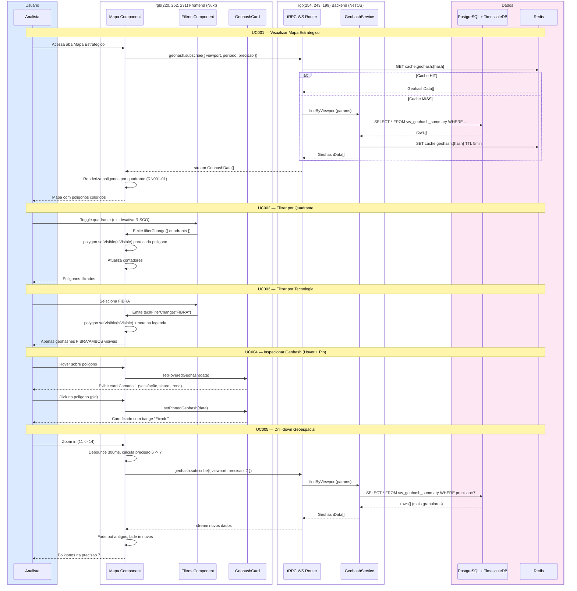

# SD001 — Navegação e Filtragem no Mapa

**UCs Referenciados:** [UC001](../UC001-visualizar-mapa-estrategico/UC001-main-flow.md), [UC002](../UC002-filtrar-por-quadrante/UC002-main-flow.md), [UC003](../UC003-filtrar-por-tecnologia/UC003-main-flow.md), [UC004](../UC004-inspecionar-geohash/UC004-main-flow.md), [UC005](../UC005-drill-down-geoespacial/UC005-main-flow.md)

**Atores/Sistemas envolvidos:** Analista, Nuxt Frontend, NestJS Backend (tRPC), PostgreSQL, Redis, Google Maps API

---

## Notas do Diagrama

- **Passos 3-11:** UC001 fluxo principal. Cache Redis com TTL 5min para reduzir carga no PG.
- **Passos 13-16:** UC002 e operação local (frontend), sem ida ao backend.
- **Passos 18-20:** UC003 idem — filtro local.
- **Passos 22-26:** UC004 — hover e pin sao operacoes locais sobre dados ja carregados.
- **Passos 28-36:** UC005 — drill-down dispara nova subscription com precisao diferente.
