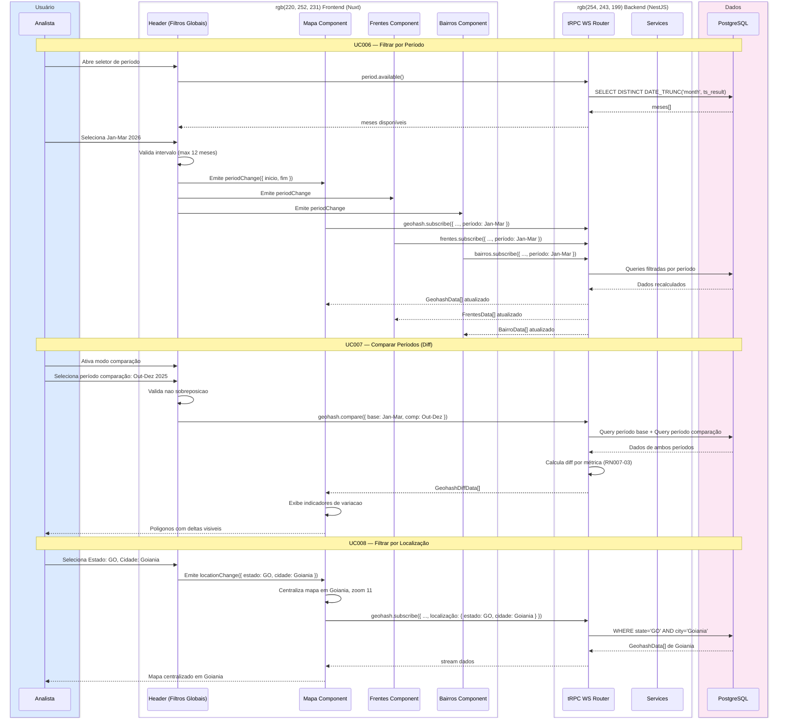

# SD002 — Filtros Globais (Período + Localização)

**UCs Referenciados:** [UC006](../UC006-filtrar-por-periodo/UC006-main-flow.md), [UC007](../UC007-comparar-periodos/UC007-main-flow.md), [UC008](../UC008-filtrar-por-localizacao/UC008-main-flow.md)

**Atores/Sistemas envolvidos:** Analista, Nuxt Frontend, NestJS Backend (tRPC), PostgreSQL, Google Maps API

---

## Notas do Diagrama

- **Passos 1-17:** UC006 — mudança de período propaga para TODAS as abas simultaneamente via contexto global.
- **Passos 19-28:** UC007 — backend calcula diff server-side para nao sobrecarregar frontend.
- **Passos 30-38:** UC008 — localização centraliza mapa e filtra dados. Bidirecional com pan do mapa.
