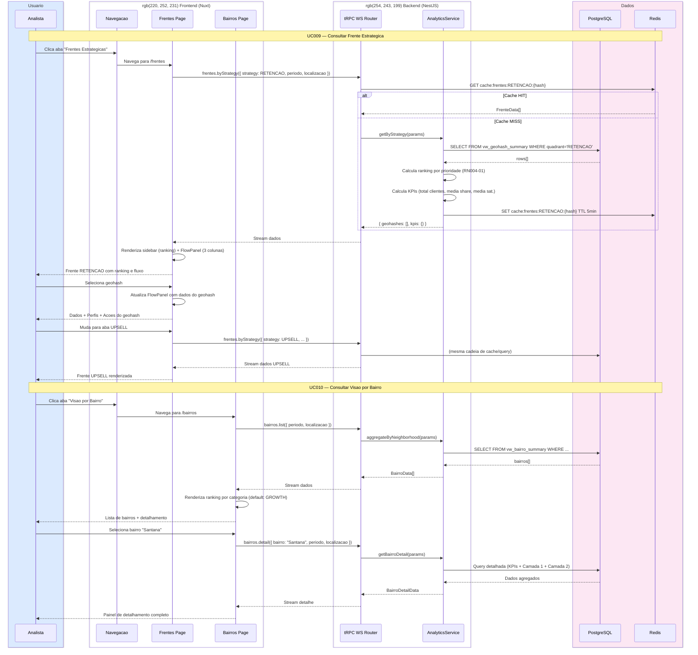

# SD003 — Consulta de Frentes e Bairros

**UCs Referenciados:** [UC009](../UC009-consultar-frente-estrategica/UC009-main-flow.md), [UC010](../UC010-consultar-visao-bairro/UC010-main-flow.md)

**Atores/Sistemas envolvidos:** Analista, Nuxt Frontend, NestJS Backend (tRPC), PostgreSQL, Redis

---

## Notas do Diagrama

- **Passos 1-16:** UC009 — fluxo completo de consulta de frente com cache Redis.
- **Passos 18-20:** Selecao de geohash e operacao local (dados ja carregados).
- **Passos 22-26:** Mudanca de aba de estrategia dispara nova query.
- **Passos 28-37:** UC010 — lista de bairros carregada na navegacao.
- **Passos 39-46:** Selecao de bairro pode carregar detalhes adicionais do backend.
