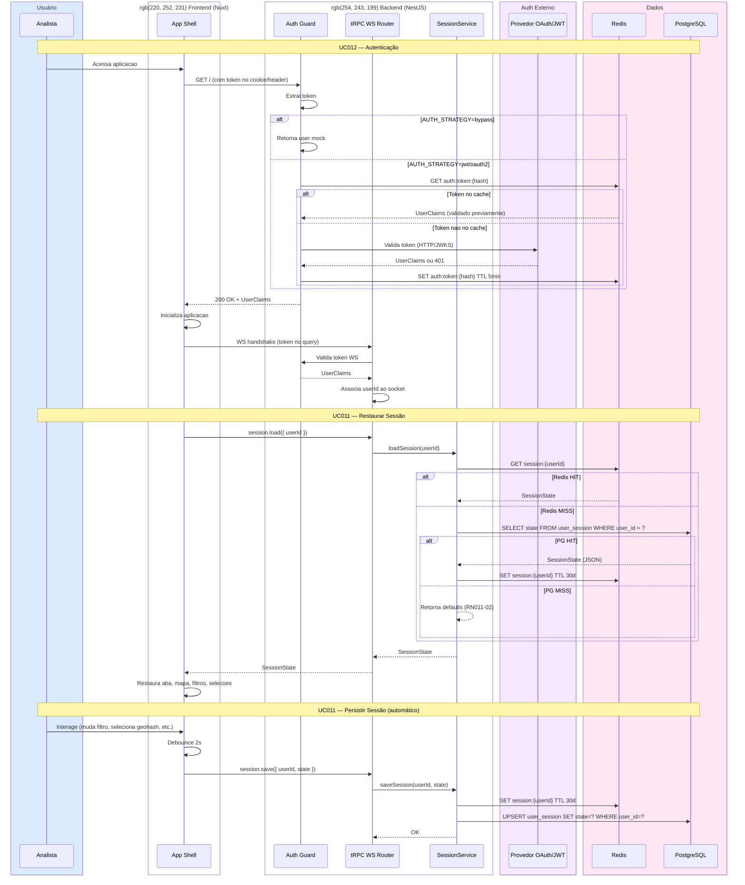

# SD004 — Sessão e Autenticação

**UCs Referenciados:** [UC011](../UC011-persistir-sessao/UC011-main-flow.md), [UC012](../UC012-autenticar-usuario/UC012-main-flow.md)

**Atores/Sistemas envolvidos:** Analista, Nuxt Frontend, NestJS Backend, Redis, PostgreSQL, Provedor Auth Externo

---

## Notas do Diagrama

- **Passos 1-14:** UC012 — fluxo de autenticação com cache de token no Redis.
- **Passos 16-18:** Handshake WS valida token para associar socket ao userId.
- **Passos 20-32:** UC011 restauração — cascata Redis -> PG -> defaults.
- **Passos 34-41:** UC011 persistência — debounce 2s, dupla escrita Redis + PG.
- O cache de token (5min TTL) reduz chamadas ao provedor externo.
- A sessão (30d TTL) garante continuidade entre visitas.
